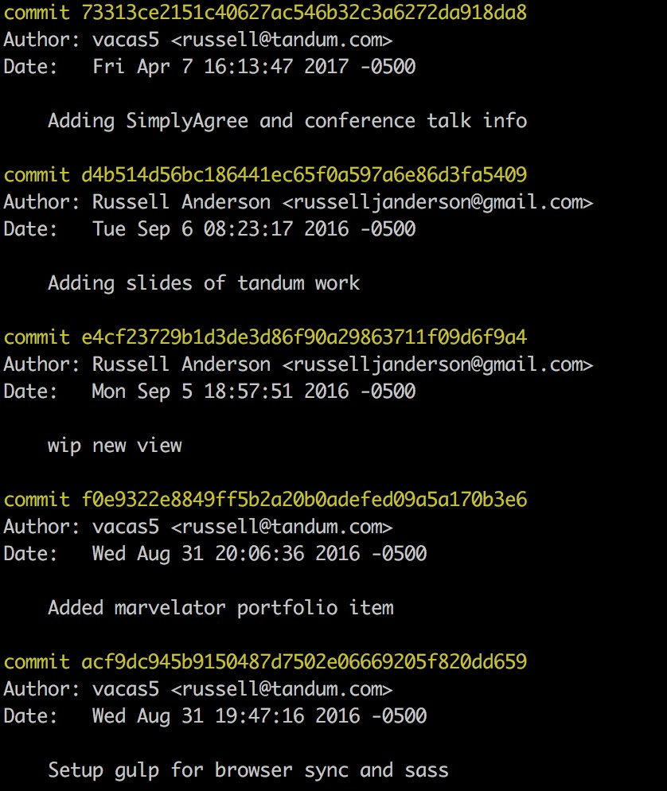
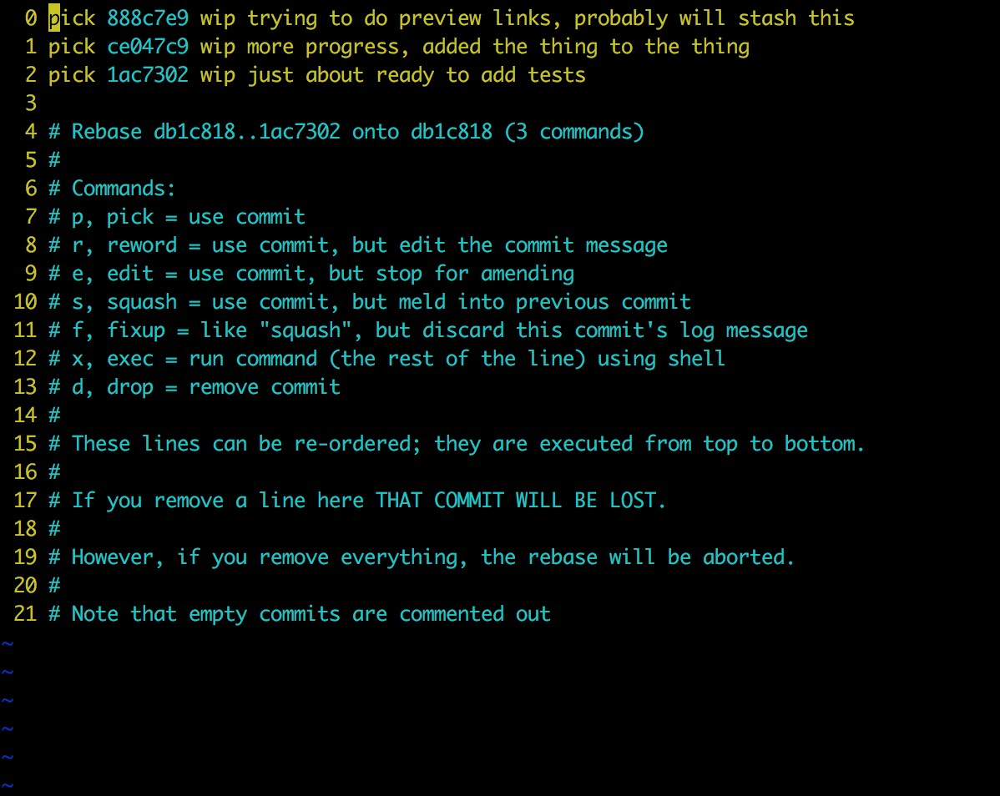

##Moving work to another branch

Often times I find myself in the following scenario: I am working on a feature branch, deep down in the weeds, but I notice a separate bug. Usually this bug is minor and annoying, and would take me all of five minutes to resolve. Instinctively I fix such a minor thing that already has my attention and move on to continuing the primary task at hand.

Later, maybe hours or maybe days, as I begin reviewing work to commit using `git add -p`, I remember "oh yeah I fixed that unrelated thing, and it doesn't really belong in here". I could just make an additional commit and keep going. But maybe my feature isn't quite ready yet, and the bug is fixed and ready to be merged. Maybe someone else's work could benefit from having that annoying bug fixed, too. I need to get it off of my branch and into it's own branch and get a pull request ready.

Here is how I handle, depending on the situation.

###The work isn't yet committed

This scenario is not too difficult, but you have to be disciplined. If the minor bug fix you want to move off this branch is not yet committed or staged, begin by committing all other work first. This probably rules out usage of `git add .` or adding entire files at a time.

My colleague [@jacqueswoodcock](https://twitter.com/jacqueswoodcock) trained me on how to use git, and some sage advice he passed along was to use the git add patch functionality:

```
git add -p
```

If you're unfamiliar with this command, go read [Self Code Review with Git Add Patch](https://dev.to/sharpshark28/self-code-review-with-git-add-patch). This command is paramount for me reviewing my code before it's committed. It helps me remember "oh yeah I wanted to add some comments here", or "there's a leftover console.log" before I even open a pull request. It also can help one out of some very tricky situations in code, where you have made several changes in a single file but they really belong in separate commits (or in our case, separate branches).

Using `git add -p` you should be able to commit everything _but_ the bugfix you want to move. So do that.

Next, stash it using:

```
git stash
```

Git stash is a powerful, if somewhat mysterious command. Often it helps me in situations when I just need a complete do-over. Combined with `git add -p` it can save me from going through file by file and deleting lines I don't need. In this particular case, stash will take all that work we _do_ need and hold onto it for us in the ether. After stashing, let's checkout our base branch, and then checkout a brand new branch for our simple bug fix. After this is done, run:

```
git stash pop
```

This will take the latest stuff we stashed and pop it onto the new branch as unstaged changes. Now we can review, add and commit as usual, push this branch up and open a pull request. You can encounter merge conflicts after this command, perhaps if something on your base branch changed while you were at work elsewhere. In this case you'll just need to fix them and immediately make a commit. Nicely done.

###The work has already been committed

Conversely, we might encounter a situation in which we have already committed something that we want to introduce to the codebase independent of other commits in our branch. This can be a bit trickier but it is totally possible as long as we're confident the commit we want to move is self-contained. But I'm sure you only ever make small, fully realized commits anyway, right?

First, let's use `git log` to show all our most recent commits.



Now, let's copy (or however you want to take note of) that commit that we want to move. Then, let's move it. Check out your base branch again, and cut a new branch from it, similar to what we did with the stash. Instead of popping from the stash, run:

```
git cherry-pick e4cf23729b1d3de3d86f90a29863711f09d6f9a4
```

Obviously, replace the hash with the one you copied. This will take that commit and add only it to your new branch. Voila, you can now push this upstream and open a pull request. Again, there may be conflicts here, so don't freak out. Because your commits are so incremental they'll be easy to fix, right?

You can even pull over multiple commits this way if need be. There is one last thing to resolve, though. We need to get the commit we just cherry picked out of our original feature branch. To deal with this, the first thing we'll do is go back to our base branch (for the sake of argument let's just say it's called `master`). Checkout `master` and then pull to make sure you're up to date with the upstream. (Side note, if you've forked a repo, you may have set the original repo as upstream and your fork in this case would be "origin".) You may need to push to get your remote "origin" up to date. Whatever you need to do, make sure that "origin/master" is up to date.

Now check out that old feature branch with the commits you've already moved. Things are about to get weird so hold on. Run:

```
git rebase -i origin/master
```

You'll then see something that looks like the following image.



So, if you're scared of using rebase, I can appreciate that. A lot of folks are warned off of it as dangerous, and it certainly can have some pretty bad results if you don't know what you're doing. But I swear by it to help me maintain a clean git history with informative commits (for my future self). Using the interactive (`-i`) argument really helps me understand all that's going on with it. In the screencap you can see that the instructions are always there if you forget what you're doing.

In our case, let's say for the sake of argument that the top commit is the one that we've cherry picked over. All we need to do in this case is replace the work "pick" with "d" or "drop", and then close our text editor. The rebase will do it's thing, forgetting all about the commit we've cherry picked to another branch. You'll have to force push your branch now, which may seem scary, but we know what we've done and we no longer need that commit.

Time for a snack.
