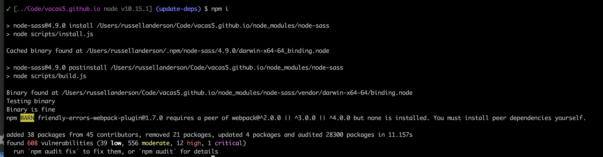
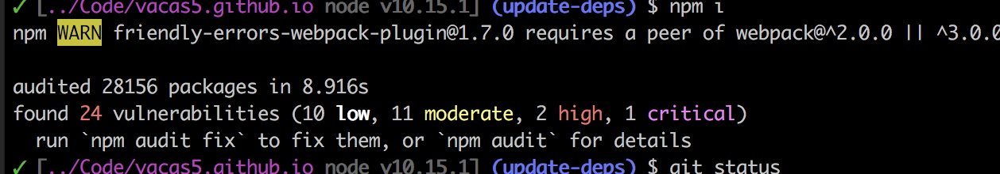
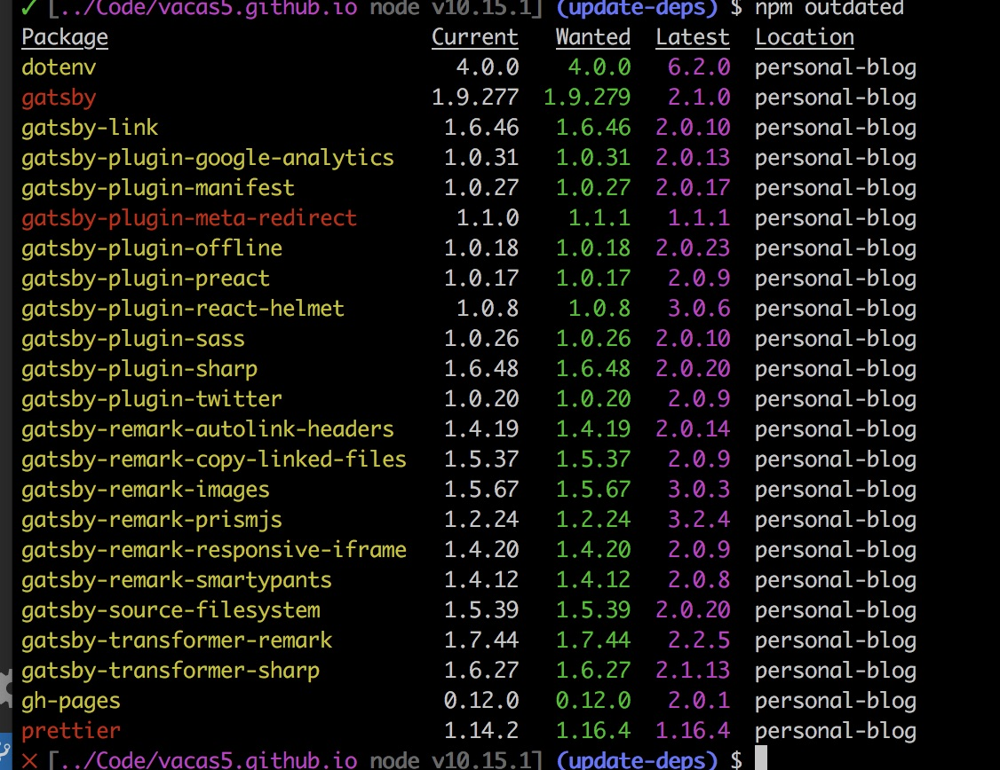
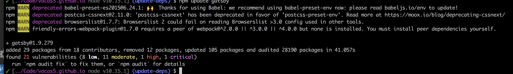
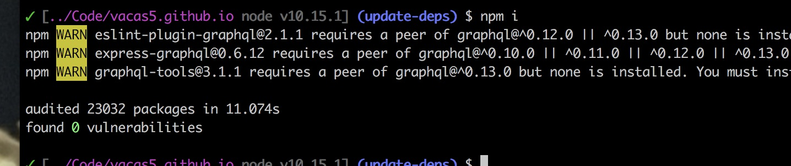

In recent weeks at [Lonely Planet](http://lonelyplanet.com) we've embarked on a fresh application using [Next.js](https://nextjs.org/). It's exciting to work on something so bleeding edge, and it looks to be a helpful library.

We're still setting up tooling, and we are already getting warnings from [npm](http://npmjs.org) command line when we install. Certain open sources packages that we rely on themselves have outdated dependencies. Some of these we maintain and some of them we do not.

I've used this as an excuse to try and minimize the warnings coming from the packages we maintain by updating their dependencies. I've peered into the abyss, and I'm here to report that it can successfully be done, but it will leave one scarred.

I know I've written about this subject before, but it bears repeating.

## dependencies are tech debt by nature

The JavaScript ecosystem creates a special variety of dependency hell. The efforts to modularize code are worthwhile, as are efforts to rely on open source to not waste time solving already solved problems. But, JavaScript in particular has a huge community of developers, and is the entry point for a lot of people (myself included) into serious programming. Ever since the days of jQuery plugins we have often reached too quickly for someone else's code.

I can't directly control someone else's code. I can contribute to open source projects, but those projects have to be maintained and PRs accepted. Often I rely on code that relies on code that relies on code that needs to be updated, and trying to contribute to that process and see it all the way to the end codebase is untenable.

Other people's code can lead to [major security vulnerabilites](https://snyk.io/blog/malicious-code-found-in-npm-package-event-stream/). I should take great pains to minimize the dependencies I use. Even something as innocuous as left-pad can cause major problems.

Realistically, if I'm using a JS framework of some sort, I'll have crazy dependencies. This personal blog is built with Gatsby, and as a result it already has 23,032 packages. Every one of those dependencies can be considered technical debt. Faster development now, for headaches down the road.

## The process

I am going to use my personal blog as an example. I'll start by installing
```
npm i
```

I'm using node version 10.15.1 btw. npm 6.8.0. Here's what that yields:



### npm audit fix

Let's look at those last couple of lines, the one about how it "found 608 vulnerabilities (39 low, 556 moderate, 12 high, 1 critical)". That sounds bad. So, it suggests I try to run `npm audit` to fix. So, I'll investigate what that [actually does](https://docs.npmjs.com/cli/audit).

So, the output of audit looks pretty intimidating. It shows me a fair amount of warnings in packages several levels deep. I'm going to make a commit to my package-lock.json right now, and then run `npm audit fix` and see what happens.

Here's what it says afterwards:
```
+ lodash@4.17.11
added 18 packages from 41 contributors, removed 35 packages, updated 4 packages and moved 3 packages in 12.762s
fixed 36 of 608 vulnerabilities in 28300 scanned packages
  8 package updates for 572 vulns involved breaking changes
  (use `npm audit fix --force` to install breaking changes; or refer to `npm audit` for steps to fix these manually)
```

Taking a look at things, it made a LOT of changes to my package-lock.json but only one change to package.json. Conceivably, this would mean that the next time I run `npm install`, it will go back to a vulnerable build again. I run my `npm run dev` command though and everything seems to be peachy, even with all the dependency tree changes, so I am going to commit and proceed.

Okay so I tested running `npm install` again and here's what I got:


That looks like progress. And, I don't have any package-lock changes, so let's continue moving forward!

### npm outdated

Okay so I've got this warning about the "friendly-errors-webpack-plugin", however, that is not listed in my package.json at all, so I'll do some digging to see what depends on it. I can run `npm ls friendly-errors-webpack-plugin` to find out where it is in the tree.

After running it tells me that it's a dependency of "gatsby@1.9.277". I sort of knew I'd need to update all of gatsby to 2.0. It should be done anyway but this is definitely biting off a bit more.

So, the underlying issue here is that a package we rely on `gatsby@1.9.277` depends on an old version of webpack, but depends on another package that expects a NEWER version of webpack. This is pervasive dependency hell, everyone.

To try and resolve, I am going to run `npm outdated` and see if theres a minor fix or something I could use that might resolve the issue. Here's what that looks like:


This is a very handy command. It shows you which version you're on, the highest available minor/patch release under "Wanted" and then latest available major release under "Latest". If you're not on the Latest, you should consider upgrading, but you're gonna have a bad time.

So, contrary to what you might expect, red means go, yellow means stop, and green is... non-existent. Packages in red should be able to be safely updated to the latest minor or patch version with trivial changes. I'll try it. Running `npm update gatsby` to get the patch updates. Now look what I get:



Well, damn! Now I have more warnings. This is wild. I'll check and see if my app still works (it should). The app works great. Luckily it's pretty basic, but imagine the regression testing I'd need to do on a complex application.

So, I went ahead and ran `npm audit fix` again, and those other warnings went away! Not sure exactly how, but that's a bonus. Still stuck with the "friendly-errors-webpack-plugin" error though.

### bumping something based on a starter

Okay so as I suspected, I am going to have to bump Gatsby entirely. Checking out my outdated, you can see how many gatsby related dependencies I use. My guess is that most of these are going to need to be bumped simultaneously. This is going to be tricky if any of them don't support the newer version of gatsby.

How does one even go about doing this? Well, I based this project off of a starter, [gatsby-starter-blog-no-styles](https://github.com/noahg/gatsby-starter-blog-no-styles), so I'm going to check and see if that starter project has updated it's dependencies. Goodie, they have not. ARGH.

### updating with the big matzo ball

Failing that, I'm going to go to Gatsby's page and look at my instructions for upgrading. Luckily, they are well documented in a [blog post](https://www.gatsbyjs.org/docs/migrating-from-v1-to-v2/).

I am going to basically have to go through this whole thing. I update all of my packages prefixed by `gatsby` as well as gatsby itself, and I begin adding new peer dependencies.

All in all, this wasn't so bad, but I had to make a number of changes to other files based on Gatsby's upgrade. The plugins seemed to all work out of the box, thank goodness. One hangup that I hadn't considered was that my code utilized the legacy React context API. So, I had to refactor all of that because gatsby@2.0 relies on an updated version of React.

Pro-tip: have a lot of test coverage.

I am glad that I'm on the latest version. This is a good thing in the long run, and there are a lot of improvements I can take advantage of. You want to know the sad part though?


No longer do I have the "friendly-errors-webpack-plugin" warning, but rather I have a fresh set of warnings related to graphql. I am stuck in dependency hell.
