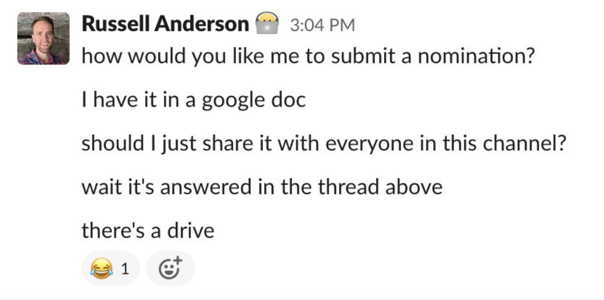

I was discussing [this article](https://abe-winter.github.io/plea's/help/2018/02/11/slack.html) with a few colleagues in Nashville, and one of them said this and I thought it was profound:

> I think an issue with Slack or any instant messaging platform is that it encourages immediate responses rather than thoughtful responses.

I've written about Slack before but I am turning back to the idea of "thoughtful communication" as I prepare to present to my fellow managers about asynchronous communication. While I believe strong asynchronous communication processes as vital for any distributed org, what might be a prerequisite to that is that the org values and greatly encourages _thoughtful responses_ over _immediate responses_.

This is related but not restricted to async comms. Synchronous comms such as meetings can be thoughtful, too. And asynchronous comms are often curt, vague, or unclear. In my mind this is a value that needs to be in place at an organization before a major effort to go more asynchronous.

What can we do as managers or individual contributors to exhort our teams towards thoughtful communication?

## Why is thoughtful better?

### Right > Immediate

When I think back on my career I can remember dozens of "brainstorming" sessions or "fact finding" meetings where responses are given off the cuff. Very few times can I remember a boss asking me a question and saying, "take a few hours and really think about this before responding." Often I've seen push back from experienced developers asking for time to research answers to questions they don't know the answer rather than give a snap reply, having learned better.

It seems as though we believe that we can get "right" answers ad hoc. As leaders, that is what we should optimize for: the right answer. We don't want to move forward in the wrong direction just to move forward. But how do we get reliable answers? Can it really be done in the seconds after a question is asked?

### Inclusive

There's an exclusivity to seeking immediate rather than thoughtful responses. Let's say we're in a large meeting, 20 people or so, and we're discussing a topic and asking a number of questions. Inherently, this format will favor those who are most comfortable speaking up in front of a large crowd and putting the spotlight on themselves. While I myself as a white male have rarely felt insecure not to bloviate on a topic I know little about, the same can't be said of all my colleagues. If you've ever worked on a multi-lingual team, how much of the way you seek info favors native English speakers?

Furthermore, if we're using a tool like an instant messenger to find immediate answers, and we present questions as needing immediate responses, that will also favor our most experienced people. We'll miss out on an opportunity for junior people to grow by fact finding themselves. The rich will only get richer, and we'll continue to silo knowledge with a few responsive experienced teammates.

### Creating organizational memory

As managers we have to be thinking long term, too. Not only do we want to promote acting on the _right_ answers, ideally we are creating organizational memory so that we're not asking the same questions over and over. One of the thing I'm very cautious of is repeating mistakes. We should be moving our people from saying things like, "well I think we did it this way because" to "here in the design document it outlines the reasoning of that decision."

The medium in which we ask our questions often determines if the answer is documented at all, and whether or not we can benefit from it in the future or it just disappears into the ether.

## What makes it so hard to be thoughtful

### We are addicted to immediacy

It's not just Slack. It's text messaging. It's ChatGPT. We're wired to get an answer ASAP. And oh yeah, it also feels real good to answer questions immediately.

This has created an environment where availability is now a metric to judge employees. And answering in real time also gives us the sense of productivity even if we completely distracted ourselves from a more important task. Now, we're always on, ready to snipe with _any_ answer regardless if it's right. I love this quote from the article I linked above.

> slack comes in and makes ‘work’ visible in the form of instant replies to quick questions, dancing emoji stickers, and nonstop chatter, and some people are like, ‘yes! look at all that my team has accomplished’.

For the same reason we don't want to create a work culture where just showing up at the office is counted as productivity, we don't want to reward people or ourselves for giving vague wrong answers to questions in a message just to prove avaiability. You want people solving valuable problems for your business.

### We don't have any margin or the resources

If you looked at my calendar you might have a bit more sympathy for the way that I ask questions. I'm often instant messaging _while in a meeting_. I often ask a question just as a thought placeholder so I know to come back to it. "Here, let me distract you just so that I don't forget." This is bad; this needs to change.

But even if I had the time, it's not a given that a place exists to find the answer. If I have to rely on other people to get questions answered, this means I'm vulnerable to them leaving. A lack of organizational memory is risky business. Knowledge should get out of people's heads as much as possible.

## How do we promote this as managers?

So, what can we do as leaders to turn the tide?

### Thoughtful responses begin with thoughtful questions

As leaders we have to control how we ask questions, when we ask questions, and where we ask questions.

Before pinging an employee with an instant message, even in a public channel, I ask myself if its worth distracting them. Maybe the question will answer itself if I wait a bit, or maybe I can compile it into a list of questions that they can tackle when it's convenient for them. What about email? There isn't the same sense of urgency, so let me ask my non-urgent questions there.

I am trying to avoid sending messages like this:

Instead, I should just send the meeting invite and let the calendar serve as the notification and beginning of the discussion.

### Self discovery

I've also started to try a bit harder to answer my own questions before asking them. I don't want to use other people just because it's convenient. Let me scour the wiki. Let me read the git history. If I can't find a place that it's documented, then I know that it isn't discoverable for anyone else on my team, either, and we can improve that.

Here's another really bad example from my Slack history:

Less verbal vomit processing and more intentionality with my communication.

The same logic can be applied to answering questions. I have challenged myself not to use the words "I think" when answering a question if possible, and try and dig for a source of truth for that answer. If I find it, I kindly link to it in my response so people can reference it later. If I can't find it, then I create it so we have the answer documented in the future.

### Setting expectations with my team

It's also really benefitted me to set clear expectations on how and where certain communication happens. Do we respond to Jira notifications and within what time frame? How do we use our Atlassian wiki? What about Github wiki and pull requests? What is the expected response time on an email?

Talking this through and deciding as a team how we're going to communicate has been really helpful, and made me more patient.

## Homework

Alright, so now I challenge you: Find three recent examples of when someone directly messaged or @ mentioned you for a response on something that was not really urgent. How did that make you feel? How were you able to respond? Now find three examples of when you DMd someone for something non-urgent.

What can you do today to be more thoughtful?
